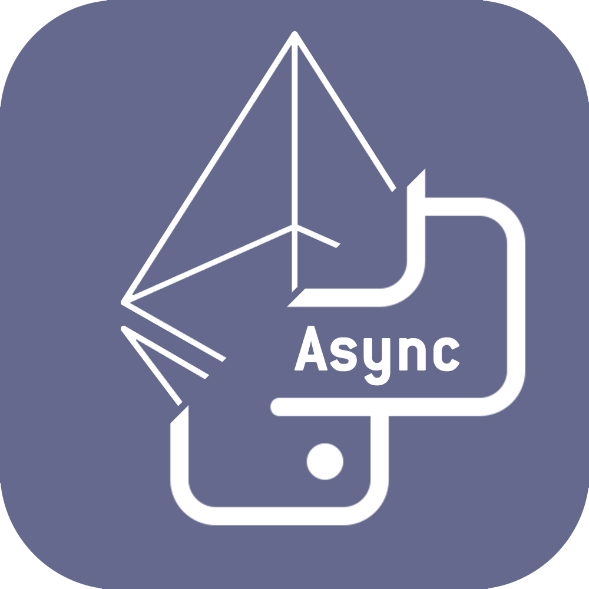

<h1><p align="center">py-eth-async</p></h1>

<p align="center"></p>


<h1><p align="center">Content</p></h1>

- [Description](#Description)
- [Useful links](#Useful-links)
- [Installation](#Installation)
- [Report a bug or suggest an idea](#Report-a-bug-or-suggest-an-idea)
- [Express your gratitude](#Express-your-gratitude)


<h1><p align="center">Description</p></h1>
<p align="right"><a href="#Content">To the content</a></p>

⠀This library is an asynchronous add-on to the `Web3` library, designed to simplify interaction with it.


<h1><p align="center">Useful links</p></h1>
<p align="right"><a href="#Content">To the content</a></p>

⠀[py-eth-async](https://github.com/SecorD0/py-eth-async)

⠀[py-eth](https://github.com/SecorD0/py-eth)


<h1><p align="center">Installation</p></h1>
<p align="right"><a href="#Content">To the content</a></p>

⠀You need execute the command below to install or update the library:
```sh
pip install --force-reinstall git+https://github.com/SecorD0/py-eth-async
```


<h1><p align="center">Report a bug or suggest an idea</p></h1>
<p align="right"><a href="#Content">To the content</a></p>

⠀If you found a bug or have an idea, go to [the link](https://github.com/SecorD0/py-eth-async/issues/new/choose), select the template, fill it out and submit it.


<h1><p align="center">Express your gratitude</p></h1>
<p align="right"><a href="#Content">To the content</a></p>

⠀You can express your gratitude to the developer by sending fund to crypto wallets!
- Address of EVM networks (Ethereum, Polygon, BSC, etc.): `0x900649087b8D7b9f799F880427DacCF2286D8F20`
- USDT TRC-20: `TNpBdjcmR5KzMVCBJTRYMJp16gCkQHu84K`
- SOL: `DoZpXzGj5rEZVhEVzYdtwpzbXR8ifk5bajHybAmZvR4H`
- BTC: `bc1qs4a0c3fntlhzn9j297qdsh3splcju54xscjstc`
