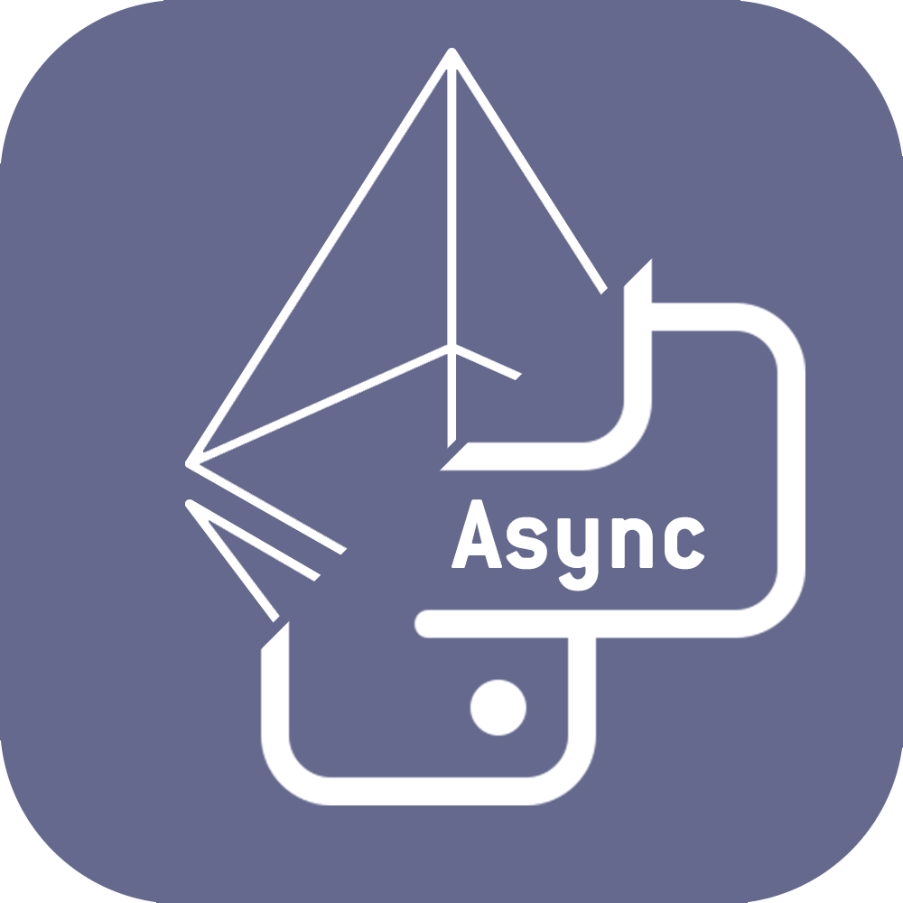

<h1>
py-eth-async
</h1><h1>

<h1>
Content
</h1>

- [Report a bug or suggest an idea](#Report-a-bug-or-suggest-an-idea)
- [Express your gratitude](#Express-your-gratitude)

<h1>
Report a bug or suggest an idea
</h1>

<a href="#Content">To the content</a>

⠀If you found a bug or have an idea, go to [the link](https://github.com/SecorD0/py-eth-async/issues/new/choose), select the template, fill it out and submit it.

<h1>
Express your gratitude
</h1>

<a href="#Content">To the content</a>

⠀You can express your gratitude to the developer by sending fund to crypto wallets!
- Ethereum-like address (Ethereum, BSC, Moonbeam, etc.): `0x900649087b8D7b9f799F880427DacCF2286D8F20`
- USDT TRC-20: `TNpBdjcmR5KzMVCBJTRYMJp16gCkQHu84K`
- SOL: `DoZpXzGj5rEZVhEVzYdtwpzbXR8ifk5bajHybAmZvR4H`
- BTC: `bc1qs4a0c3fntlhzn9j297qdsh3splcju54xscjstc`
